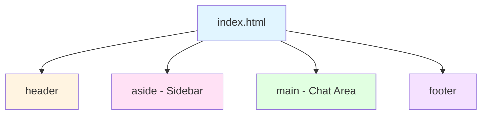
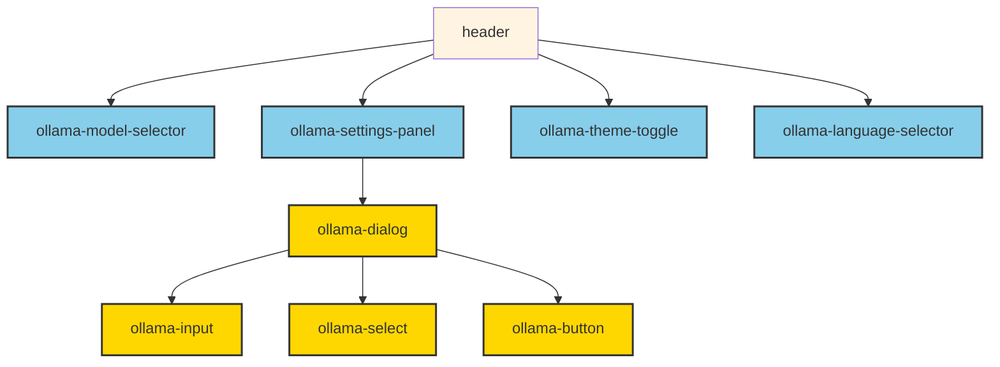
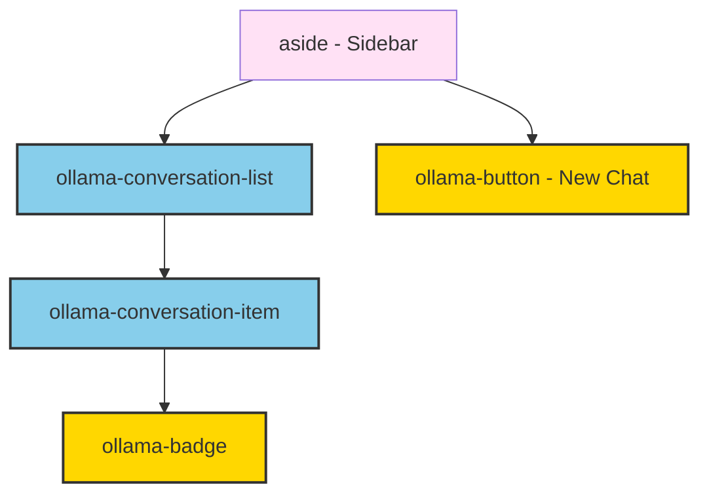
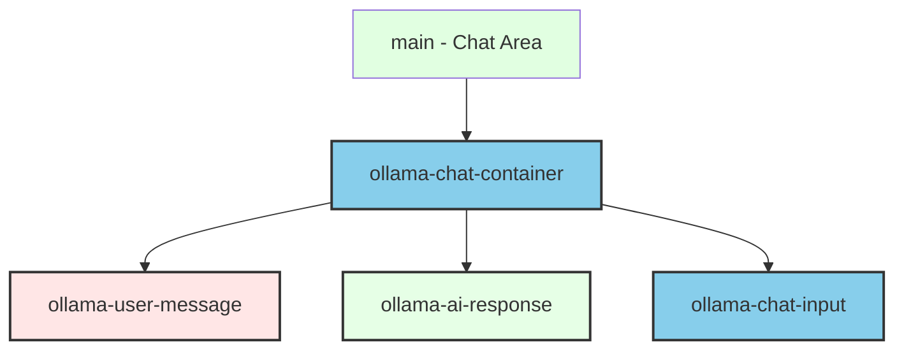
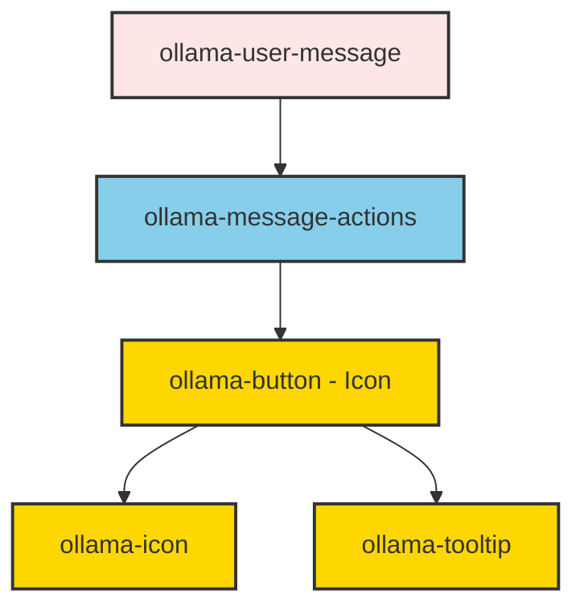
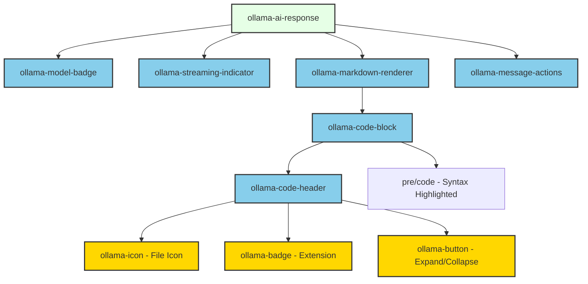
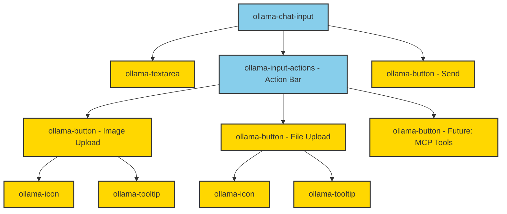
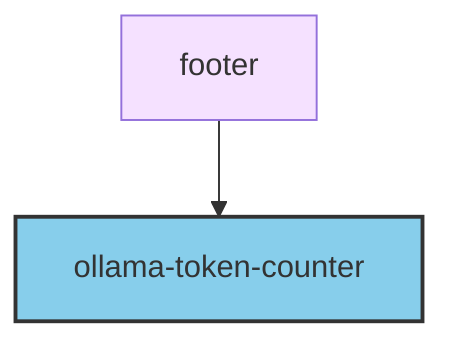

# Development Specification

## Overview

Technical implementation details, architecture decisions, and development guidelines for Ollama Chat.

## Executive Summary

This specification defines the technical requirements for building Ollama Chat, a local-first AI chat client using Web Components, WebSockets, and SQLite.

### Quick Reference

| Section | Key Topics | Priority |
|---------|-----------|----------|
| [DR-1: Web Components](#dr-1-web-components-implementation) | Component architecture, reuse policy, 28 component library | HIGH |
| [DR-1a: Icon-First UI](#dr-1a-icon-first-ui-pattern) | Lucide icons, tooltips, standard icon mappings | HIGH |
| [DR-1b: Message Layout](#dr-1b-message-layout-and-content-rendering) | User bubbles vs AI full-width, real-time markdown, collapsible code blocks | HIGH |
| [DR-2: Semantic HTML](#dr-2-semantic-html5-structure) | Layout tags (header/main/aside/nav/footer) | MEDIUM |
| [DR-3: Lucide Icons](#dr-3-lucide-icons-integration) | Icon library setup, size variants, accessibility | MEDIUM |
| [DR-4: Theming System](#dr-4-theming-system) | CSS custom properties, light/dark modes, custom user themes | HIGH |
| [DR-5: Localization (i18n)](#dr-5-localization-i18n) | Native Intl APIs, locale files, RTL support | HIGH |
| [DR-6: Docker Environment](#dr-6-docker-development-environment) | 3-container setup (frontend/backend/ollama), Makefile, hot-reload | HIGH |
| [DR-7: FOUC Prevention](#dr-7-flash-of-unstyled-content-fouc-prevention) | Loading strategy to prevent unstyled content flash | LOW |
| [DR-8: WebSocket Server](#dr-8-backend-websocket-server) | Node.js server, message protocol, Ollama integration | HIGH |
| [DR-9: Database Schema](#dr-9-database-schema) | SQLite schema for conversations, messages, tokens, settings | HIGH |
| [DR-10: WebSocket Client](#dr-10-websocket-client-implementation) | Reconnection, exponential backoff, message queuing | HIGH |
| [DR-11: Streaming Response](#dr-11-streaming-response-handling) | Progressive markdown rendering, code block detection | HIGH |
| [DR-12: Error Handling](#dr-12-error-handling-and-user-feedback) | SARIF format, error catalog, user-friendly messages | MEDIUM |
| [DR-13: State Management](#dr-13-component-communication-and-state-management) | Singleton pattern, event-based communication | HIGH |
| [DR-14: Security](#dr-14-security-requirements) | XSS prevention, CSP headers, input validation | HIGH |
| [DR-15: Accessibility](#dr-15-accessibility-requirements) | WCAG 2.1 AA compliance, keyboard nav, screen readers | HIGH |
| [DR-16: Performance](#dr-16-performance-guidelines) | Virtual scrolling (25 msgs), bundle size <200KB, Web Vitals | MEDIUM |
| [DR-17: Testing Strategy](#dr-17-testing-strategy) | Vitest, Playwright, 80% coverage target | MEDIUM |
| [DR-18: API Contracts](#dr-18-backend-api-message-contracts) | 19 WebSocket message types, request/response patterns | HIGH |
| [DR-19: File Display](#dr-19-file-display-components) | Project view, file tree, syntax highlighting, streaming display | HIGH |
| [DR-20: Live Preview](#dr-20-live-preview-system) | Sandboxed iframe, blob URLs, error handling, auto-refresh | HIGH |
| [DR-21: Project Export](#dr-21-project-export) | ZIP download, directory structure, metadata, size limits | MEDIUM |
| [DR-22: LLM Prompts](#dr-22-llm-prompt-engineering-and-guidance) | System prompts, approach verification, file format, placeholder detection | HIGH |

### Core Design Principles

1. **Web Components Only**: No React, Vue, Angular, or other frameworks
2. **Icon-First UI**: Use Lucide icons with tooltips instead of text labels
3. **Compact by Default**: Tight spacing (2px/4px/8px) for information density
4. **Visual Consistency**: Reuse existing components, justify new ones
5. **RTL-First**: Support Arabic/Hebrew with logical CSS properties
6. **Streaming-Native**: Real-time markdown rendering during LLM streaming
7. **Local-First**: SQLite + WebSockets, no cloud dependencies
8. **Accessible**: WCAG 2.1 AA compliance from day one
9. **Secure**: XSS prevention, CSP headers, input validation
10. **Performance**: <200KB bundle, virtual scrolling, lazy loading

## Technology Stack

### Frontend
- **HTML5**: Semantic markup for application structure
- **Web Components**: Custom elements using native browser APIs (NO frameworks like React/Vue)
- **Lucide Icons**: Exclusive icon library (https://lucide.dev)
- **CSS**: Component-scoped styling with theming support
- **JavaScript**: ES modules, modern browser features

### Infrastructure
- **Docker**: Containerized development environment for consistency across machines
- **Ollama**: Local LLM runtime (exclusive backend - NOT a generic LLM client)

### Backend
- **WebSocket Server**: Node.js-based WebSocket server for real-time communication
- **SQLite**: Embedded database for conversation history, token logs, and user preferences
- **Ollama API**: Standard Ollama HTTP API (https://github.com/ollama/ollama/blob/main/docs/api.md)

## Architecture

### Component-Based Architecture
- Use Web Components for all reusable UI elements
- Semantic HTML5 tags (`<header>`, `<main>`, `<aside>`, `<nav>`, etc.) for layout
- Web Components for controls and individual sections

### Client Architecture
- Single-page application (SPA) structure
- Event-driven communication between components
- WebSocket connection to backend for real-time LLM streaming

### Backend Architecture
- **WebSocket Server**: Manages client connections and message routing
- **Ollama Client**: Communicates with Ollama API, handles streaming responses
- **Database Layer**: SQLite for persistence (conversations, messages, tokens, settings)
- **Message Flow**: Client → WebSocket → Backend → Ollama → Backend → WebSocket → Client

### Component Hierarchy

#### High-Level Application Structure



---

#### Header Section



---

#### Sidebar Section



---

#### Main Chat Area



---

#### User Message Component



---

#### AI Response Component



---

#### Chat Input Component



---

#### Footer Section



---

**Legend**:
- Light colored boxes: Semantic HTML5 elements
- Pink (`ollama-user-message`): User messages (bubble style, constrained width)
- Green (`ollama-ai-response`): AI responses (full-width, no bubble)
- Sky blue (Feature Components): Chat-specific components
- Gold (Base Components): Reusable base components

## Implementation Requirements

### DR-1: Web Components Implementation
**Requirement**: Build all UI components as native Web Components with strict reusability and consistency.

**Technical Specifications**:
- MUST use Custom Elements API (`customElements.define()`)
- MUST use Shadow DOM for style encapsulation
- MUST define components inline in HTML `<script>` tags BEFORE first usage to prevent FOUC (flash of unstyled content)
- MUST follow naming convention: `ollama-*` prefix (e.g., `<ollama-chat-message>`)
- MUST support attribute-based configuration
- MUST emit custom events for component communication
- SHOULD use `<template>` tags for component markup

**Component Reuse Policy**:
- MUST reuse existing components before creating new ones
- Creating new components requires justification (document why existing components insufficient)
- Visual consistency is CRITICAL - new components must match existing design patterns
- When in doubt, extend existing components rather than create new ones

**Common Component Library**:

| Component | Type | Description |
|-----------|------|-------------|
| **Base Components** (src/components/base/) - MUST be reused everywhere |
| `<ollama-button>` | Leaf | All buttons (primary, secondary, icon-only variants) |
| `<ollama-dialog>` | Container | All modal dialogs and popups |
| `<ollama-input>` | Leaf | All text inputs |
| `<ollama-textarea>` | Leaf | Multi-line text input |
| `<ollama-icon>` | Leaf | All icons (wraps Lucide icons) |
| `<ollama-tooltip>` | Leaf | All tooltips |
| `<ollama-select>` | Leaf | All dropdowns/selects |
| `<ollama-spinner>` | Leaf | Loading indicators |
| `<ollama-badge>` | Leaf | Labels, tags, status indicators |
| `<ollama-error-toast>` | Experience | Floating toast notifications with dismiss and action buttons |
| `<ollama-error-banner>` | Experience | Persistent full-width banners for critical errors |
| `<ollama-error-inline>` | Leaf | Inline validation error messages |
| **Feature Components** (src/components/features/) - Chat-specific |
| `<ollama-chat-container>` | Container | Main chat layout wrapper, holds all chat UI |
| `<ollama-chat-message>` | Container | Individual message wrapper (delegates to user-message or ai-response) |
| `<ollama-user-message>` | Experience | User message bubble with actions (constrained width, bubble style) |
| `<ollama-ai-response>` | Experience | AI response with markdown, code blocks, streaming (full-width, no bubble) |
| `<ollama-markdown-renderer>` | Experience | Live markdown rendering during streaming, delegates to code-block |
| `<ollama-code-block>` | Experience | Collapsible code display with header and syntax-highlighted content |
| `<ollama-code-header>` | Experience | Code block header (file icon, extension badge, line count, expand/collapse button) |
| `<ollama-chat-input>` | Experience | Message compose area with textarea, action bar, and send button |
| `<ollama-input-actions>` | Experience | Action button bar below textarea (image upload, file upload, future MCP tools) |
| `<ollama-conversation-list>` | Container | Sidebar list of conversations, holds conversation-item components |
| `<ollama-conversation-item>` | Experience | Single conversation in list with badge, title, and metadata |
| `<ollama-model-selector>` | Experience | Dropdown to select active LLM model (uses select + icon) |
| `<ollama-model-badge>` | Leaf | Visual indicator showing which model was used for a message |
| `<ollama-token-counter>` | Leaf | Display token usage stats (read-only display) |
| `<ollama-streaming-indicator>` | Leaf | Visual feedback during streaming responses (animated indicator) |
| `<ollama-message-actions>` | Experience | Action buttons for messages (copy, regenerate, delete with icons and tooltips) |
| `<ollama-settings-panel>` | Experience | Settings dialog with inputs, selects, and theme options |
| `<ollama-theme-toggle>` | Experience | Light/dark theme switcher (button with icon) |
| `<ollama-language-selector>` | Experience | Language/locale picker (select with flag icons) |
| `<ollama-project-view>` | Experience | Project display with metadata, file tree, and download button |
| `<ollama-file-tree>` | Experience | Hierarchical file structure with collapsible directories |
| `<ollama-file-display>` | Experience | File content with syntax highlighting, streaming support, and copy button |
| `<ollama-preview-panel>` | Experience | Sandboxed iframe preview with controls and error display |
| `<ollama-export-button>` | Leaf | Project download button with loading state and file size |

**Component Type Definitions**:
- **Leaf**: Single-purpose component with no child components (button, icon, input, badge)
- **Container**: Layout component that holds and positions other components but adds minimal UI (chat-container, conversation-list)
- **Experience**: Composed component that combines multiple child components to deliver a complete user interaction (chat-input, ai-response, code-block)

**Example Pattern**:
```html
<script>
  class OllamaChatMessage extends HTMLElement {
    constructor() {
      super();
      this.attachShadow({ mode: 'open' });
    }
    // Implementation
  }
  customElements.define('ollama-chat-message', OllamaChatMessage);
</script>
<ollama-chat-message></ollama-chat-message>
```

---

### DR-1a: Icon-First UI Pattern
**Requirement**: Prefer icon-only buttons with tooltips for common actions over text labels.

**Technical Specifications**:
- Icon buttons MUST use `<ollama-button variant="icon">` with `<ollama-icon>` child
- ALL icon-only buttons MUST have `<ollama-tooltip>` for accessibility and discoverability
- Tooltips MUST appear on hover and focus
- Common actions (delete, edit, copy, send, etc.) SHOULD use icons only
- Text labels SHOULD be used only for primary CTAs or uncommon actions
- Icon choice MUST be semantically obvious (use common conventions)

**Example Pattern**:
```html
<!-- Good: Icon with tooltip -->
<ollama-button variant="icon" aria-label="Delete message">
  <ollama-icon name="trash-2"></ollama-icon>
  <ollama-tooltip>Delete message</ollama-tooltip>
</ollama-button>

<!-- Bad: Icon with redundant text -->
<ollama-button>
  <ollama-icon name="trash-2"></ollama-icon>
  Delete
</ollama-button>
```

**Common Icon Mappings** (use these consistently):
- `trash-2` - Delete
- `edit-3` or `pencil` - Edit
- `copy` - Copy
- `check` - Confirm/Success
- `x` - Close/Cancel
- `send` - Send message
- `plus` - Add/New
- `settings` - Settings
- `image` - Upload image
- `message-square` - New conversation

---

### DR-1b: Message Layout and Content Rendering
**Requirement**: Differentiate user and AI message presentation with focus on content readability.

**Technical Specifications**:

*User Messages*:
- MUST use `<ollama-user-message>` component
- MUST constrain width (bubble/card style, not full-width)
- SHOULD align to right or use visual distinction from AI responses
- Plain text rendering (no markdown processing needed)

*AI Responses*:
- MUST use `<ollama-ai-response>` component
- MUST use full width of chat area (no bubble/container constraint)
- Focus on content, not decoration
- MUST detect and render markdown in real-time during streaming
- MUST detect code blocks and render with special treatment

*Markdown Rendering* (`<ollama-markdown-renderer>`):
- MUST render markdown progressively as tokens stream in
- MUST support: headings, lists, bold, italic, links, blockquotes
- MUST use syntax highlighting for inline code
- MUST delegate code blocks to `<ollama-code-block>` component
- SHOULD use a lightweight markdown parser compatible with streaming

*Code Block Rendering* (`<ollama-code-block>`):
- MUST detect language from markdown fence (e.g., ```python, ```javascript)
- MUST render collapsed by default with header visible
- Header (`<ollama-code-header>`) MUST show:
  - File icon (language-specific from Lucide)
  - File extension badge (e.g., `.py`, `.js`, `.html`)
  - Line count that updates live during streaming
  - Expand/collapse button (icon-only with tooltip)
- MUST syntax highlight code (use lightweight library or CSS-based)
- MUST support copy-to-clipboard action
- Expanded state shows full pretty-printed code
- Collapsed state shows only header

**Language Icon Mappings**:
- JavaScript/TypeScript: `file-code` icon, `.js`/`.ts` extension
- Python: `file-code` icon, `.py` extension
- HTML: `file-code` icon, `.html` extension
- CSS: `file-code` icon, `.css` extension
- JSON: `file-code` icon, `.json` extension
- Other: `file` icon, appropriate extension

**Example Collapsed Code Block**:
```
┌─────────────────────────────────────────┐
│ 📄 .py        42 lines      [Expand ▼] │
└─────────────────────────────────────────┘
```

**Example Expanded Code Block**:
```
┌─────────────────────────────────────────┐
│ 📄 .py        42 lines      [Collapse ▲]│
├─────────────────────────────────────────┤
│  1  def hello_world():                  │
│  2      print("Hello, World!")          │
│  3                                       │
│ ...                                      │
│ 42      return result                   │
└─────────────────────────────────────────┘
```

---

### DR-2: Semantic HTML Structure
**Requirement**: Use semantic HTML5 elements for application layout.

**Technical Specifications**:
- MUST use `<header>`, `<nav>`, `<main>`, `<aside>`, `<footer>` for layout
- MUST use `<article>`, `<section>` for content grouping
- Web Components ONLY for interactive controls and reusable sections
- MUST maintain accessible landmark structure
- MUST use appropriate heading hierarchy (`<h1>` through `<h6>`)

---

### DR-3: Lucide Icons Integration
**Requirement**: Use Lucide icons exclusively for all iconography.

**Technical Specifications**:
- MUST use Lucide icon library from https://lucide.dev
- MUST load icons via CDN or npm package
- SHOULD create `<ollama-icon>` component wrapper for consistent usage
- MUST support icon sizing via CSS custom properties
- MUST support theming (color inheritance)
- Icons MUST be accessible (proper ARIA labels)

---

### DR-4: Theming and Styling System
**Requirement**: Implement comprehensive CSS custom properties-based theming with support for light, dark, and custom user themes.

**Technical Specifications**:

*CSS Custom Properties Structure*:
- MUST define all design tokens as CSS custom properties at `:root` level
- Categories MUST include:
  - Colors (backgrounds, text, borders, accents, status colors)
  - Spacing (margins, padding, gaps)
  - Typography (font families, sizes, weights, line heights)
  - Borders (radius, widths)
  - Shadows
  - Transitions/animations
- ALL components MUST use these variables, NEVER hardcoded values
- MUST use logical CSS properties for RTL support (see DR-5)

*Built-in Themes*:
- MUST provide `light` theme (default for light system preference)
- MUST provide `dark` theme (default for dark system preference)
- Themes applied via `data-theme` attribute on root element: `<html data-theme="light">`

*Theme Selection Priority*:
1. User-selected theme (stored in localStorage)
2. System preference (`prefers-color-scheme` media query)
3. Default to `light` if no preference detected

*Custom User Themes*:
- MUST allow users to create custom color themes
- Custom themes stored as JSON in localStorage: `{ name: "Ocean", colors: {...} }`
- Custom themes MUST override color variables only (spacing/typography remain consistent)
- UI MUST provide theme editor in settings panel
- MUST validate custom colors for accessibility (contrast ratios)

*Theme Implementation*:
- Theme changes MUST apply instantly without page reload
- ALL theme data persisted in localStorage
- Theme state managed in global theme utility (`/src/utils/theme.js`)

**Design System Organization**:
The design system MUST be organized into separate CSS files for maintainability:
- `/src/styles/tokens.css` - Design tokens (spacing, typography, etc.)
- `/src/styles/themes/light.css` - Light theme colors
- `/src/styles/themes/dark.css` - Dark theme colors
- `/src/styles/global.css` - Global styles, resets, base element styles
- `/src/styles/utilities.css` - Utility classes (optional, minimize usage)

**Design Philosophy**:
- **Compact by Default**: UI MUST use tight padding and margins for space efficiency
- **Information Density**: Maximize visible content, minimize chrome and decoration
- **Breathing Room Where It Matters**: Use larger spacing only for major section separators

**Example CSS Custom Properties**:
```css
/* tokens.css */
:root {
  /* Spacing - use with logical properties */
  /* Compact spacing scale - tight by default */
  --spacing-xs: 2px;   /* Minimal - inline element gaps */
  --spacing-sm: 4px;   /* Tight - component internal padding */
  --spacing-md: 8px;   /* Standard - default padding/margin */
  --spacing-lg: 12px;  /* Relaxed - section spacing */
  --spacing-xl: 16px;  /* Generous - major section separators */
  
  /* Typography */
  --font-family-sans: system-ui, -apple-system, sans-serif;
  --font-family-mono: 'SF Mono', Monaco, monospace;
  --font-size-sm: 0.875rem;
  --font-size-base: 1rem;
  --font-size-lg: 1.125rem;
  --font-size-xl: 1.25rem;
  --font-weight-normal: 400;
  --font-weight-medium: 500;
  --font-weight-bold: 700;
  --line-height-tight: 1.25;
  --line-height-normal: 1.5;
  --line-height-relaxed: 1.75;
  
  /* Border */
  --border-radius-sm: 4px;
  --border-radius-md: 8px;
  --border-radius-lg: 12px;
  --border-width: 1px;
  
  /* Shadows */
  --shadow-sm: 0 1px 2px rgba(0, 0, 0, 0.05);
  --shadow-md: 0 4px 6px rgba(0, 0, 0, 0.1);
  --shadow-lg: 0 10px 15px rgba(0, 0, 0, 0.1);
  
  /* Transitions */
  --transition-fast: 150ms ease;
  --transition-base: 250ms ease;
  --transition-slow: 350ms ease;
  
  /* Z-index layers */
  --z-index-dropdown: 1000;
  --z-index-modal: 2000;
  --z-index-tooltip: 3000;
}

/* Example of RTL-safe component styling */
.chat-message {
  /* GOOD: Logical properties */
  margin-inline-start: var(--spacing-md);
  padding-inline-end: var(--spacing-lg);
  border-inline-start: var(--border-width) solid var(--color-border);
  text-align: start;
  
  /* BAD: Physical properties (DO NOT USE)
  margin-left: var(--spacing-md);
  padding-right: var(--spacing-lg);
  border-left: var(--border-width) solid var(--color-border);
  text-align: left;
  */
}

/* themes/light.css */
:root,
[data-theme="light"] {
  --color-background-primary: #ffffff;
  --color-background-secondary: #f5f5f5;
  --color-background-tertiary: #e5e5e5;
  
  --color-text-primary: #1a1a1a;
  --color-text-secondary: #666666;
  --color-text-tertiary: #999999;
  
  --color-border: #d4d4d4;
  --color-border-hover: #a3a3a3;
  
  --color-accent-primary: #3b82f6;
  --color-accent-hover: #2563eb;
  
  --color-success: #22c55e;
  --color-warning: #f59e0b;
  --color-error: #ef4444;
  
  --color-code-background: #f8f8f8;
  --color-user-message-bg: #e0f2fe;
}

/* Dark Theme */
[data-theme="dark"] {
  --color-background-primary: #1a1a1a;
  --color-background-secondary: #2d2d2d;
  --color-background-tertiary: #404040;
  
  --color-text-primary: #f5f5f5;
  --color-text-secondary: #a3a3a3;
  --color-text-tertiary: #737373;
  
  --color-border: #404040;
  --color-border-hover: #525252;
  
  --color-accent-primary: #60a5fa;
  --color-accent-hover: #3b82f6;
  
  --color-success: #4ade80;
  --color-warning: #fbbf24;
  --color-error: #f87171;
  
  --color-code-background: #262626;
  --color-user-message-bg: #1e3a5f;
}

/* Custom Theme Example */
[data-theme="ocean"] {
  --color-background-primary: #0c1e2e;
  --color-background-secondary: #1a3a52;
  --color-background-tertiary: #2d5573;
  --color-accent-primary: #00d4ff;
  /* ... other custom colors */
}
```

**Theme Storage Format**:
```json
{
  "selectedTheme": "dark",
  "customThemes": [
    {
      "id": "ocean",
      "name": "Ocean",
      "colors": {
        "background-primary": "#0c1e2e",
        "background-secondary": "#1a3a52",
        "accent-primary": "#00d4ff"
      }
    }
  ]
}
```

---

### DR-5: Localization (i18n) and Bidirectional Text Support
**Requirement**: Build internationalization support using native JavaScript Intl APIs with full RTL (Right-to-Left) language support.

**Technical Specifications**:

*Locale Files*:
- MUST separate all user-facing strings into locale files
- MUST use JSON format: `/src/locales/{lang}.json` (e.g., `en.json`, `fr.json`)
- MUST include `dir` property indicating text direction (`ltr` or `rtl`)
- MUST default to English (`en`)
- MUST support runtime language switching without page reload
- MUST persist language preference in localStorage

*RTL (Right-to-Left) Support*:
- MUST detect text direction from locale configuration
- MUST set `dir` attribute on `<html>` element: `<html dir="rtl">`
- MUST use logical CSS properties (NOT physical properties):
  - Use `margin-inline-start` / `margin-inline-end` (NOT `margin-left` / `margin-right`)
  - Use `padding-inline-start` / `padding-inline-end` (NOT `padding-left` / `padding-right`)
  - Use `inset-inline-start` / `inset-inline-end` (NOT `left` / `right`)
  - Use `border-inline-start` / `border-inline-end` (NOT `border-left` / `border-right`)
- MUST flip layout direction automatically based on `dir` attribute
- Icons and visual elements SHOULD mirror in RTL where semantically appropriate
- Text alignment MUST respect text direction (`text-align: start` NOT `text-align: left`)

*Locale Configuration Structure*:
```json
{
  "locale": "en",
  "dir": "ltr",
  "name": "English",
  "translations": {
    "app": { ... }
  }
}
```

*RTL Languages to Support*:
- Arabic (`ar`, `dir: "rtl"`)
- Hebrew (`he`, `dir: "rtl"`)
- (Add as needed)

*Translation String Structure*:
```json
{
  "app": {
    "title": "Ollama Chat",
    "tagline": "Build software through conversation"
  },
  "chat": {
    "input": {
      "placeholder": "Type your message...",
      "send": "Send",
      "imageUpload": "Upload image",
      "fileUpload": "Upload file"
    },
    "message": {
      "copy": "Copy",
      "regenerate": "Regenerate",
      "delete": "Delete"
    }
  },
  "sidebar": {
    "newChat": "New conversation",
    "conversations": "Conversations"
  },
  "settings": {
    "title": "Settings",
    "theme": "Theme",
    "language": "Language",
    "model": "Model"
  },
  "code": {
    "expand": "Expand code",
    "collapse": "Collapse code",
    "copy": "Copy code",
    "lines": "{count} lines"
  }
}
```

*JavaScript Intl API Usage*:
- MUST use `Intl.DateTimeFormat` for date/time formatting
- MUST use `Intl.NumberFormat` for number formatting
- MUST use `Intl.RelativeTimeFormat` for relative times (e.g., "2 hours ago")
- MUST use `Intl.PluralRules` for plural forms
- Locale passed to Intl APIs MUST match selected language

*Translation Helper* (`/src/utils/i18n.js`):
```javascript
// Example implementation pattern
class I18n {
  constructor(locale = 'en') {
    this.locale = locale;
    this.dir = 'ltr';
    this.messages = {};
  }
  
  async loadLocale(locale) {
    const response = await fetch(`/src/locales/${locale}.json`);
    const data = await response.json();
    this.messages = data.translations;
    this.locale = data.locale;
    this.dir = data.dir;
    
    // Update HTML dir attribute
    document.documentElement.setAttribute('dir', this.dir);
    document.documentElement.setAttribute('lang', this.locale);
    
    // Emit locale change event
    window.dispatchEvent(new CustomEvent('localechange', { 
      detail: { locale: this.locale, dir: this.dir } 
    }));
  }
  
  t(key, params = {}) {
    // Get nested value: "chat.input.placeholder"
    const value = key.split('.').reduce((obj, k) => obj?.[k], this.messages);
    
    // Replace {param} with values
    return value?.replace(/\{(\w+)\}/g, (_, k) => params[k] ?? `{${k}}`);
  }
  
  formatDate(date, options = {}) {
    return new Intl.DateTimeFormat(this.locale, options).format(date);
  }
  
  formatNumber(number, options = {}) {
    return new Intl.NumberFormat(this.locale, options).format(number);
  }
  
  formatRelativeTime(value, unit) {
    return new Intl.RelativeTimeFormat(this.locale).format(value, unit);
  }
  
  isRTL() {
    return this.dir === 'rtl';
  }
}
```

*Component Integration*:
- Translation function MUST be globally accessible
- Web Components SHOULD re-render on locale change
- MUST emit custom event when locale changes: `localechange`

*Supported Locales* (Initial):
- `en` - English (default, LTR)
- `fr` - French (LTR)
- `ar` - Arabic (RTL) - for testing RTL support
- `he` - Hebrew (RTL) - for testing RTL support

*Validation*:
- MUST ensure all locale files have same keys (no missing translations)
- MUST warn in console if translation key not found
- MUST fallback to English if translation missing in selected locale

---

### DR-6: Docker Development Environment
**Requirement**: Provide containerized development environment for consistency.

**Technical Specifications**:

*Docker Services*:
- **frontend**: Static file server for HTML/CSS/JS (nginx)
- **backend**: Node.js WebSocket server
- **ollama**: Ollama LLM runtime

*Port Mappings*:
- Frontend: 3000 (host) → 80 (container)
- Backend WebSocket: 8080 (host) → 8080 (container)
- Ollama API: 11434 (host) → 11434 (container)

*Volume Mounts*:
- `./src` → `/usr/share/nginx/html` (frontend, read-only in production)
- `./server` → `/app` (backend, for development hot-reload)
- `./data` → `/data` (SQLite database persistence)
- `ollama-models` → `/root/.ollama` (Ollama model storage, named volume)

*Network Configuration*:
- All services on same Docker network: `ollama-chat-network`
- Backend can reach Ollama at `http://ollama:11434`
- Frontend served by nginx, makes WebSocket connection to `ws://localhost:8080`

*Container Configuration*:
- Backend container MUST run as user `node` (UID 1000)
- Frontend container runs as nginx default user
- Ollama container runs as root (required for GPU access)
- All containers MUST have resource limits (memory, CPU)

**Dockerfile - Frontend** (`/docker/Dockerfile.frontend`):
```dockerfile
FROM nginx:alpine

# Copy static files
COPY ./src /usr/share/nginx/html

# Copy nginx configuration
COPY ./docker/nginx.conf /etc/nginx/conf.d/default.conf

# Non-root user
RUN chown -R nginx:nginx /usr/share/nginx/html

EXPOSE 80

CMD ["nginx", "-g", "daemon off;"]
```

**Nginx Configuration** (`/docker/nginx.conf`):
```nginx
server {
    listen 80;
    server_name localhost;
    root /usr/share/nginx/html;
    index index.html;

    # Serve static files
    location / {
        try_files $uri $uri/ /index.html;
    }

    # Cache static assets
    location ~* \.(js|css|png|jpg|jpeg|gif|ico|svg|woff|woff2)$ {
        expires 1y;
        add_header Cache-Control "public, immutable";
    }

    # Security headers
    add_header X-Frame-Options "SAMEORIGIN" always;
    add_header X-Content-Type-Options "nosniff" always;
    add_header X-XSS-Protection "1; mode=block" always;

    # Disable caching for HTML
    location = /index.html {
        add_header Cache-Control "no-cache, no-store, must-revalidate";
    }

    # CORS for WebSocket (development)
    add_header Access-Control-Allow-Origin "*" always;
}
```

**Dockerfile - Backend** (`/docker/Dockerfile.backend`):
```dockerfile
FROM node:20-alpine

# Create app directory
WORKDIR /app

# Install dependencies
COPY ./server/package*.json ./
RUN npm ci --only=production

# Copy application code
COPY ./server ./

# Create non-root user
RUN addgroup -g 1001 nodegroup && \
    adduser -D -u 1001 -G nodegroup nodeuser && \
    chown -R nodeuser:nodegroup /app

# Create data directory
RUN mkdir -p /data && chown nodeuser:nodegroup /data

USER nodeuser

EXPOSE 8080

CMD ["node", "index.js"]
```

**Docker Compose** (`/docker-compose.yml`):
```yaml
version: '3.8'

services:
  # Frontend - Static file server
  frontend:
    build:
      context: .
      dockerfile: docker/Dockerfile.frontend
    container_name: ollama-chat-frontend
    ports:
      - "3000:80"
    volumes:
      # Development: mount source for hot reload
      - ./src:/usr/share/nginx/html:ro
    networks:
      - ollama-chat-network
    restart: unless-stopped

  # Backend - WebSocket server
  backend:
    build:
      context: .
      dockerfile: docker/Dockerfile.backend
    container_name: ollama-chat-backend
    ports:
      - "8080:8080"
    volumes:
      # Development: mount source for hot reload
      - ./server:/app
      - ./data:/data
      # Don't mount node_modules
      - /app/node_modules
    environment:
      - NODE_ENV=development
      - OLLAMA_URL=http://ollama:11434
      - DB_PATH=/data/ollama-chat.db
      - WS_PORT=8080
    networks:
      - ollama-chat-network
    depends_on:
      - ollama
    restart: unless-stopped
    # Resource limits
    deploy:
      resources:
        limits:
          memory: 512M
          cpus: '1.0'

  # Ollama - LLM runtime
  ollama:
    image: ollama/ollama:latest
    container_name: ollama-chat-ollama
    ports:
      - "11434:11434"
    volumes:
      - ollama-models:/root/.ollama
    networks:
      - ollama-chat-network
    restart: unless-stopped
    # GPU support (optional, uncomment if NVIDIA GPU available)
    # deploy:
    #   resources:
    #     reservations:
    #       devices:
    #         - driver: nvidia
    #           count: 1
    #           capabilities: [gpu]

networks:
  ollama-chat-network:
    driver: bridge

volumes:
  ollama-models:
    driver: local
```

**Development Docker Compose Override** (`/docker-compose.dev.yml`):
```yaml
version: '3.8'

services:
  backend:
    environment:
      - NODE_ENV=development
      - DEBUG=*
    command: npm run dev  # Uses nodemon for hot reload
    volumes:
      - ./server:/app
      - /app/node_modules

  frontend:
    # In dev, nginx auto-reloads when files change
    volumes:
      - ./src:/usr/share/nginx/html:ro
```

**Production Docker Compose Override** (`/docker-compose.prod.yml`):
```yaml
version: '3.8'

services:
  backend:
    environment:
      - NODE_ENV=production
    command: node index.js
    # No source volume mount in production
    volumes:
      - ./data:/data

  frontend:
    # Build-time copy only, no volume mount
    volumes: []
```

*Health Checks*:
```yaml
# Add to docker-compose.yml services
backend:
  healthcheck:
    test: ["CMD", "wget", "--quiet", "--tries=1", "--spider", "http://localhost:8080/health"]
    interval: 30s
    timeout: 10s
    retries: 3
    start_period: 40s

ollama:
  healthcheck:
    test: ["CMD", "curl", "-f", "http://localhost:11434/api/tags"]
    interval: 30s
    timeout: 10s
    retries: 3
    start_period: 60s
```

---

### DR-7: Flash of Unstyled Content (FOUC) Prevention
**Requirement**: Prevent flash of unstyled content during component registration.

**Technical Specifications**:
- MUST define all Web Components BEFORE they appear in DOM
- MUST use `:not(:defined)` CSS to hide undefined components
- SHOULD use `<script>` tags in `<head>` for critical components
- SHOULD show loading state until components ready
- MUST wait for `customElements.whenDefined()` before critical operations

**Pattern**:
```css
:not(:defined) {
  visibility: hidden;
}
```

---

### DR-8: Backend WebSocket Server
**Requirement**: Implement Node.js WebSocket server for real-time communication with clients and Ollama.

**Technical Specifications**:

*Server Stack*:
- MUST use Node.js runtime
- MUST use `ws` library for WebSocket server
- MUST use `better-sqlite3` for database operations
- MUST use native `fetch` or `node-fetch` for Ollama API calls

*WebSocket Protocol*:
- MUST accept WebSocket connections on designated port (default: 8080)
- MUST implement JSON-based message protocol
- MUST include message types: `chat`, `model.list`, `model.select`, `conversation.list`, `conversation.create`, `conversation.switch`, `settings.update`
- MUST validate all incoming messages
- MUST handle client disconnection gracefully

*Message Format*:
```javascript
// Client → Server
{
  "type": "chat",
  "data": {
    "conversationId": "uuid-here",
    "message": "User message text",
    "model": "llama2",
    "images": ["base64..."] // optional
  }
}

// Server → Client (streaming)
{
  "type": "chat.stream",
  "data": {
    "messageId": "uuid-here",
    "conversationId": "uuid-here",
    "chunk": "partial response text",
    "done": false,
    "tokens": {
      "prompt": 0,
      "completion": 5,
      "total": 5
    }
  }
}

// Server → Client (complete)
{
  "type": "chat.complete",
  "data": {
    "messageId": "uuid-here",
    "conversationId": "uuid-here",
    "fullResponse": "complete response",
    "tokens": {
      "prompt": 45,
      "completion": 120,
      "total": 165
    }
  }
}

// Error
{
  "type": "error",
  "data": {
    "code": "OLLAMA_UNAVAILABLE",
    "message": "Cannot connect to Ollama",
    "retryable": true
  }
}
```

*Ollama API Integration*:
- MUST use Ollama `/api/generate` endpoint for chat completion
- MUST use streaming mode (`"stream": true`)
- MUST parse NDJSON (newline-delimited JSON) responses from Ollama
- MUST forward streaming chunks to client via WebSocket
- MUST accumulate full response for database storage
- MUST extract token counts from Ollama response
- MUST use `/api/tags` endpoint to list available models
- MUST validate model availability before sending chat request

*Connection Management*:
- MUST implement ping/pong heartbeat (every 30 seconds)
- MUST detect and handle client disconnection
- MUST cleanup resources on disconnect (abort Ollama requests, close DB transactions)
- SHOULD support reconnection with conversation state restoration

*Error Handling*:
- MUST catch and handle Ollama API errors (unavailable, timeout, invalid model)
- MUST send structured error messages to client
- MUST distinguish between retryable and non-retryable errors
- MUST log errors to console with timestamps

**Example Ollama API Call**:
```javascript
// POST to http://localhost:11434/api/generate
{
  "model": "llama2",
  "prompt": "User message here",
  "stream": true,
  "images": ["base64..."] // optional, for vision models
}

// Response (NDJSON stream)
{"model":"llama2","response":"Hello","done":false}
{"model":"llama2","response":" there","done":false}
{"model":"llama2","response":"!","done":true,"total_duration":1234,"prompt_eval_count":45,"eval_count":120}
```

---

### DR-9: Database Schema and Persistence
**Requirement**: Use SQLite for storing conversations, messages, token usage, and user preferences.

**Technical Specifications**:

*Database Technology*:
- MUST use SQLite 3
- MUST use `better-sqlite3` library (synchronous, faster than async alternatives)
- Database file location: `/data/ollama-chat.db` (Docker volume mount)
- MUST enable WAL mode for better concurrency: `PRAGMA journal_mode=WAL`
- MUST enable foreign keys: `PRAGMA foreign_keys=ON`

*Schema*:

```sql
-- Conversations
CREATE TABLE conversations (
  id TEXT PRIMARY KEY,              -- UUID
  title TEXT,                        -- Auto-generated or user-set
  model TEXT NOT NULL,               -- Model used (can change per message but track default)
  created_at INTEGER NOT NULL,       -- Unix timestamp (ms)
  updated_at INTEGER NOT NULL,       -- Unix timestamp (ms)
  metadata TEXT                      -- JSON: theme, settings, etc.
);

-- Projects (for FR-7)
CREATE TABLE projects (
  id TEXT PRIMARY KEY,               -- UUID
  conversation_id TEXT NOT NULL,     -- FK to conversations
  name TEXT NOT NULL,                -- Project name
  description TEXT,                  -- Optional project description
  created_at INTEGER NOT NULL,       -- Unix timestamp (ms)
  updated_at INTEGER NOT NULL,       -- Unix timestamp (ms)
  FOREIGN KEY (conversation_id) REFERENCES conversations(id) ON DELETE CASCADE
);

-- Project Files (for FR-7, FR-8)
CREATE TABLE project_files (
  id TEXT PRIMARY KEY,               -- UUID
  project_id TEXT NOT NULL,          -- FK to projects
  path TEXT NOT NULL,                -- File path (e.g., "src/index.html", "styles/main.css")
  content TEXT NOT NULL,             -- File content
  language TEXT NOT NULL,            -- File type for syntax highlighting (html, css, js, etc.)
  size INTEGER NOT NULL,             -- Content size in bytes
  created_at INTEGER NOT NULL,       -- Unix timestamp (ms)
  updated_at INTEGER NOT NULL,       -- Unix timestamp (ms)
  FOREIGN KEY (project_id) REFERENCES projects(id) ON DELETE CASCADE,
  UNIQUE(project_id, path)           -- Each path unique within project
);

-- Messages
CREATE TABLE messages (
  id TEXT PRIMARY KEY,               -- UUID
  conversation_id TEXT NOT NULL,     -- FK to conversations
  role TEXT NOT NULL,                -- 'user' or 'assistant'
  content TEXT NOT NULL,             -- Message text
  model TEXT,                        -- Model used (for assistant messages)
  images TEXT,                       -- JSON array of base64 images (for user messages)
  project_id TEXT,                   -- Optional FK to projects (if message generated project)
  created_at INTEGER NOT NULL,       -- Unix timestamp (ms)
  FOREIGN KEY (conversation_id) REFERENCES conversations(id) ON DELETE CASCADE,
  FOREIGN KEY (project_id) REFERENCES projects(id) ON DELETE SET NULL
);

-- Token Usage Log (for FR-1)
CREATE TABLE token_usage (
  id INTEGER PRIMARY KEY AUTOINCREMENT,
  message_id TEXT NOT NULL,          -- FK to messages
  conversation_id TEXT NOT NULL,     -- Denormalized for easier queries
  model TEXT NOT NULL,
  prompt_tokens INTEGER NOT NULL,    -- Input tokens
  completion_tokens INTEGER NOT NULL,-- Output tokens
  total_tokens INTEGER NOT NULL,     -- Sum
  created_at INTEGER NOT NULL,       -- Unix timestamp (ms)
  FOREIGN KEY (message_id) REFERENCES messages(id) ON DELETE CASCADE,
  FOREIGN KEY (conversation_id) REFERENCES conversations(id) ON DELETE CASCADE
);

-- User Settings
CREATE TABLE settings (
  key TEXT PRIMARY KEY,              -- Setting name
  value TEXT NOT NULL,               -- JSON-encoded value
  updated_at INTEGER NOT NULL        -- Unix timestamp (ms)
);

-- Indexes
CREATE INDEX idx_messages_conversation ON messages(conversation_id, created_at);
CREATE INDEX idx_messages_project ON messages(project_id);
CREATE INDEX idx_tokens_conversation ON token_usage(conversation_id);
CREATE INDEX idx_tokens_message ON token_usage(message_id);
CREATE INDEX idx_conversations_updated ON conversations(updated_at DESC);
CREATE INDEX idx_projects_conversation ON projects(conversation_id);
CREATE INDEX idx_project_files_project ON project_files(project_id);
```

*Database Operations*:
- MUST use prepared statements for all queries
- MUST wrap multi-step operations in transactions
- MUST handle unique constraint violations gracefully
- SHOULD implement database migrations for schema changes
- MUST backup database before migrations

*Settings Storage*:
- Theme preference: `{"key": "theme", "value": "\"dark\""}`
- Language preference: `{"key": "language", "value": "\"en\""}`
- Custom themes: `{"key": "customThemes", "value": "[{...}]"}`

*Conversation Title Generation*:
- Auto-generate title from first user message (first 50 chars or summary)
- Allow user to edit title
- Update `updated_at` on every new message

---

### DR-10: WebSocket Client Implementation
**Requirement**: Implement robust WebSocket client with reconnection and state management.

**Technical Specifications**:

*Client Library* (`/src/utils/websocket-client.js`):
- MUST create WebSocket connection to backend (ws://localhost:8080 or configured URL)
- MUST implement automatic reconnection with exponential backoff
- MUST queue messages when disconnected
- MUST emit events for connection state changes
- MUST handle message parsing and routing

*Connection States*:
- `CONNECTING` - Initial connection attempt
- `CONNECTED` - Active connection
- `DISCONNECTED` - Connection lost
- `RECONNECTING` - Attempting to reconnect
- `FAILED` - Reconnection attempts exhausted

*Reconnection Strategy*:
- Initial retry: 1 second
- Max retry delay: 30 seconds
- Exponential backoff: delay *= 2
- Max retry attempts: 10
- Reset backoff on successful connection

*Message Queuing*:
- Queue outgoing messages when disconnected
- Send queued messages on reconnection (FIFO)
- Discard queue on intentional disconnect
- Max queue size: 100 messages

**Example Implementation Pattern**:
```javascript
class WebSocketClient extends EventTarget {
  constructor(url) {
    super();
    this.url = url;
    this.ws = null;
    this.state = 'DISCONNECTED';
    this.messageQueue = [];
    this.reconnectAttempts = 0;
    this.reconnectDelay = 1000;
  }
  
  connect() {
    this.state = 'CONNECTING';
    this.ws = new WebSocket(this.url);
    
    this.ws.onopen = () => {
      this.state = 'CONNECTED';
      this.reconnectAttempts = 0;
      this.reconnectDelay = 1000;
      this.dispatchEvent(new CustomEvent('connected'));
      this.flushQueue();
    };
    
    this.ws.onmessage = (event) => {
      const message = JSON.parse(event.data);
      this.dispatchEvent(new CustomEvent('message', { detail: message }));
    };
    
    this.ws.onclose = () => {
      this.state = 'DISCONNECTED';
      this.dispatchEvent(new CustomEvent('disconnected'));
      this.attemptReconnect();
    };
    
    this.ws.onerror = (error) => {
      this.dispatchEvent(new CustomEvent('error', { detail: error }));
    };
  }
  
  send(message) {
    if (this.state === 'CONNECTED') {
      this.ws.send(JSON.stringify(message));
    } else {
      this.messageQueue.push(message);
    }
  }
  
  attemptReconnect() {
    if (this.reconnectAttempts >= 10) {
      this.state = 'FAILED';
      this.dispatchEvent(new CustomEvent('failed'));
      return;
    }
    
    this.state = 'RECONNECTING';
    this.reconnectAttempts++;
    
    setTimeout(() => {
      this.connect();
    }, this.reconnectDelay);
    
    this.reconnectDelay = Math.min(this.reconnectDelay * 2, 30000);
  }
  
  flushQueue() {
    while (this.messageQueue.length > 0) {
      this.send(this.messageQueue.shift());
    }
  }
}
```

*Integration with Components*:
- Global WebSocket instance accessible to all components
- Components listen to WebSocket events via custom events
- UI MUST show connection status indicator
- UI MUST disable chat input when disconnected
- UI SHOULD show reconnection progress

---

### DR-11: Streaming Response Handling
**Requirement**: Handle progressive markdown and code rendering during LLM streaming.

**Technical Specifications**:

*Stream Processing*:
- MUST append chunks to response buffer as they arrive
- MUST trigger markdown rendering after each chunk
- MUST detect code block boundaries during streaming
- MUST handle incomplete markdown syntax gracefully

*Markdown Parsing Strategy*:
- Use incremental parsing (don't re-parse entire message on each chunk)
- Detect code fences (```) and defer code block rendering until fence closes
- Render inline markdown (bold, italic, links) progressively
- Buffer incomplete tokens (e.g., partial URLs, incomplete bold markers)

*Code Block Detection*:
```javascript
// Detect opening fence
const codeBlockRegex = /```(\w+)?\n/g;

// Track state
let inCodeBlock = false;
let codeLanguage = '';
let codeBuffer = '';

// On each chunk
function processChunk(chunk) {
  if (chunk.includes('```')) {
    if (!inCodeBlock) {
      // Opening fence
      const match = codeBlockRegex.exec(chunk);
      codeLanguage = match[1] || 'text';
      inCodeBlock = true;
      codeBuffer = '';
    } else {
      // Closing fence
      inCodeBlock = false;
      renderCodeBlock(codeBuffer, codeLanguage);
      codeBuffer = '';
    }
  } else if (inCodeBlock) {
    codeBuffer += chunk;
    updateLineCount(codeBuffer.split('\n').length);
  } else {
    renderMarkdown(chunk);
  }
}
```

*Progressive Rendering Performance*:
- SHOULD debounce rendering updates (max 60fps / ~16ms)
- MUST auto-scroll to bottom as content arrives
- SHOULD use `requestAnimationFrame` for smooth scrolling
- MUST prevent layout thrashing from frequent DOM updates

*Buffer Management*:
- Keep incomplete tokens in buffer until complete
- Example: `**bold te` (incomplete bold) - wait for more chunks
- Flush buffer on stream completion
- Handle edge cases (stream ends mid-syntax)

*User Experience During Streaming*:
- Show streaming indicator on AI message
- Update line count in code block header in real-time
- Keep send button disabled during streaming
- Allow user to stop generation (send abort message via WebSocket)

---

### DR-12: Error Handling and User Notifications
**Requirement**: Implement comprehensive error handling with user-friendly notifications using SARIF format for error details.

**Technical Specifications**:

*Error Categories*:
1. **Connection Errors** - WebSocket, network, Ollama connectivity
2. **Model Errors** - Model not available, loading failures
3. **Input Validation Errors** - Invalid user input, file upload issues
4. **Database Errors** - Storage failures, quota exceeded
5. **Stream Errors** - Interrupted streams, parsing failures
6. **System Errors** - Out of memory, resource limits

*Error Code Structure*:
- Format: `CATEGORY_SPECIFIC_CODE`
- Example: `CONN_WS_FAILED`, `MODEL_NOT_FOUND`, `INPUT_IMAGE_TOO_LARGE`

*SARIF (Static Analysis Results Interchange Format) Integration*:
- MUST use SARIF 2.1.0 schema for error catalog
- MUST store error definitions in `/src/errors/error-catalog.sarif.json`
- MUST include for each error rule:
  - Unique error code (id)
  - Short and full descriptions
  - Multiple message string variants (default, specific contexts)
  - Help URI for documentation
  - Severity level (note, warning, error, none)
  - Custom properties: category, retryable flag, suggested user action
- MUST support parameterized messages (e.g., "Model '{0}' not found")
- SHOULD support localization through SARIF message strings

**SARIF Error Rule Example**:
```json
{
  "id": "CONN_WS_FAILED",
  "shortDescription": {
    "text": "WebSocket connection failed"
  },
  "fullDescription": {
    "text": "Unable to establish WebSocket connection to the backend server."
  },
  "messageStrings": {
    "default": {
      "text": "Connection failed. Please check that the server is running."
    },
    "retrying": {
      "text": "Connection lost. Reconnecting (attempt {0} of {1})..."
    },
    "exhausted": {
      "text": "Unable to connect after multiple attempts. Please refresh."
    }
  },
  "helpUri": "https://docs.example.com/errors/CONN_WS_FAILED",
  "defaultConfiguration": {
    "level": "error"
  },
  "properties": {
    "category": "connection",
    "retryable": true,
    "userAction": "refresh"
  }
}
```

**Example Error Rules to Define**:
**Connection Errors** - Multiple message variants for reconnection states
**Model Errors** - Helpful suggestions (e.g., "try ollama pull modelname")
**Validation Errors** - Clear actionable messages with limits
**Database Errors** - Distinguish between transient and quota issues
**Stream Errors** - Suggest regeneration when appropriate
**System Errors** - Guide user toward resolution (close tabs, smaller models)

*Error Handler Utility Design* (`/src/utils/error-handler.js`):
- MUST load SARIF catalog on initialization
- MUST provide method to format error by code and message key
- MUST support parameter substitution (e.g., `{0}`, `{1}`)
- MUST emit global `app-error` custom event for UI components
- MUST return structured error object: code, message, level, retryable, userAction, helpUrl, category
- SHOULD log errors to console in development mode
- SHOULD handle missing error codes gracefully with fallback message

*Error Notification Components*:

Three base components MUST be created for error display:

1. **`<ollama-error-toast>`** - Floating toast notifications
   - Stack multiple toasts vertically
   - Auto-dismiss based on severity (note: 3s, warning: 5s, error: manual)
   - Display icon matching severity level
   - Include dismiss button
   - SHOULD include action buttons based on userAction property
   - Position: top-right or top-center of viewport

2. **`<ollama-error-banner>`** - Persistent banners for critical errors
   - Full-width at top of application
   - Used for: connection lost, Ollama unavailable
   - Cannot be dismissed until error resolves
   - Show reconnection progress when applicable
   - Display suggested user action prominently

3. **`<ollama-error-inline>`** - Inline validation errors
   - Display next to input fields
   - Used for: empty message, image too large, invalid format
   - Disappear when user corrects input
   - Match form field styling

*Component Integration Pattern*:
- ALL components that can fail MUST use errorHandler.notify()
- WebSocket client emits errors via errorHandler
- Database operations catch and report via errorHandler
- Input validation uses errorHandler for consistent messages

*Error Severity Levels* (from SARIF):
- `note` - Informational (blue) - auto-dismiss after 3s
- `warning` - Warning (yellow) - auto-dismiss after 5s
- `error` - Error (red) - requires user dismissal
- `none` - Silent (log only, no UI)

*User Actions* (suggested by error):
- `refresh` - Refresh page button
- `wait` - Show progress/waiting indicator
- `select_different_model` - Suggest model selector
- `regenerate` - Show regenerate button
- `close_tabs` - Suggest closing conversations
- `none` - No action needed

**Complete Error Code List**:

*Connection Errors (CONN_)*:
- `CONN_WS_FAILED` - WebSocket connection failed
- `CONN_WS_TIMEOUT` - WebSocket connection timeout
- `CONN_OLLAMA_UNAVAILABLE` - Ollama service unavailable
- `CONN_OLLAMA_TIMEOUT` - Ollama request timeout
- `CONN_NETWORK_ERROR` - General network error

*Model Errors (MODEL_)*:
- `MODEL_NOT_FOUND` - Model not installed
- `MODEL_LOADING_FAILED` - Failed to load model
- `MODEL_INCOMPATIBLE` - Model incompatible with request
- `MODEL_LIST_FAILED` - Failed to fetch model list

*Input Validation (INPUT_)*:
- `INPUT_EMPTY_MESSAGE` - Empty message submitted
- `INPUT_MESSAGE_TOO_LONG` - Message exceeds length limit
- `INPUT_IMAGE_TOO_LARGE` - Image file too large
- `INPUT_IMAGE_INVALID_FORMAT` - Unsupported image format
- `INPUT_IMAGE_NO_VISION` - Model doesn't support images
- `INPUT_FILE_READ_ERROR` - Failed to read uploaded file

*Database Errors (DB_)*:
- `DB_WRITE_FAILED` - Failed to write to database
- `DB_READ_FAILED` - Failed to read from database
- `DB_QUOTA_EXCEEDED` - Storage quota exceeded
- `DB_CORRUPTION` - Database corruption detected
- `DB_MIGRATION_FAILED` - Schema migration failed

*Stream Errors (STREAM_)*:
- `STREAM_INTERRUPTED` - Response stream interrupted
- `STREAM_PARSE_ERROR` - Failed to parse stream data
- `STREAM_TIMEOUT` - Stream timeout (no data received)
- `STREAM_BUFFER_OVERFLOW` - Stream buffer exceeded

*System Errors (SYS_)*:
- `SYS_OUT_OF_MEMORY` - Out of memory
- `SYS_QUOTA_EXCEEDED` - Browser quota exceeded
- `SYS_PERMISSION_DENIED` - Permission denied
- `SYS_UNSUPPORTED_BROWSER` - Browser not supported

---

### DR-13: Component Communication and State Management
**Requirement**: Implement lightweight global state management using native Web APIs without external dependencies.

**Technical Specifications**:

*Global State Pattern*:
- MUST use singleton JavaScript object for global application state
- MUST emit custom events on state changes
- MUST NOT use external state management libraries (Redux, MobX, etc.)
- Components SHOULD access state through getter methods
- Components MUST update state through setter methods (never directly)

*State Structure* (`/src/utils/app-state.js`):
```javascript
const AppState = {
  // Connection
  connectionStatus: 'disconnected',  // 'connected', 'disconnected', 'reconnecting'
  
  // Current context
  currentConversationId: null,
  currentModel: 'llama2',
  
  // User preferences
  theme: 'light',
  language: 'en',
  customThemes: [],
  virtualScrollThreshold: 25,  // Messages before virtual scrolling activates
  
  // UI state
  isStreaming: false,
  sidebarOpen: true
};
```

*State Access Pattern*:
- Global singleton: `window.appState` or import from module
- Getter methods: `appState.get('currentModel')`
- Setter methods: `appState.set('currentModel', 'mistral')` - emits event
- Subscribe to changes: `appState.on('change:currentModel', handler)`

*Event Naming Convention*:
- State change events: `change:propertyName` (e.g., `change:theme`, `change:connectionStatus`)
- Action events: `action:verbNoun` (e.g., `action:sendMessage`, `action:regenerateResponse`)
- Error events: `error:category` (e.g., `error:connection`, `error:validation`)
- All custom event names MUST use kebab-case for DOM events, camelCase for object properties

*Component Access to Global Utilities*:
- **Theme**: Access via `window.appState.get('theme')` or import `themeManager`
- **i18n**: Import `i18n` singleton from `/src/utils/i18n.js`
- **WebSocket**: Import `wsClient` singleton from `/src/utils/websocket-client.js`
- **Error Handler**: Import `errorHandler` from `/src/utils/error-handler.js`

*Component Communication Patterns*:

1. **Parent to Child**: Properties/attributes
```javascript
// Parent sets property on child
childElement.setAttribute('model', 'llama2');
childElement.model = 'llama2';  // or direct property
```

2. **Child to Parent**: Custom events (bubble up)
```javascript
// Child emits
this.dispatchEvent(new CustomEvent('message-sent', { 
  detail: { text: '...' },
  bubbles: true 
}));

// Parent listens
element.addEventListener('message-sent', (e) => { ... });
```

3. **Sibling to Sibling**: Via global state or shared parent
```javascript
// Component A updates global state
appState.set('currentModel', 'mistral');

// Component B listens for state change
appState.on('change:currentModel', (newModel) => {
  this.updateUI(newModel);
});
```

*State Persistence*:
- User preferences MUST persist to localStorage on change
- UI state (sidebar open, etc.) MAY persist to localStorage
- Current conversation context MUST NOT persist (security)
- Use `storage.js` utility for all localStorage operations

---

### DR-14: Security Requirements
**Requirement**: Implement comprehensive security measures to protect against common web vulnerabilities.

**Technical Specifications**:

*XSS Prevention*:
- MUST sanitize ALL markdown/HTML from LLM before rendering
- MUST use DOMPurify or equivalent sanitization library
- MUST escape user input in chat messages
- MUST NOT use `innerHTML` for untrusted content
- MUST use textContent or createElement for dynamic content
- Code blocks MUST be rendered in escaped form (syntax highlighting AFTER escaping)

*Content Security Policy (CSP)*:
- MUST implement CSP headers in nginx configuration
- MUST restrict script sources to 'self' and approved CDNs (Lucide)
- MUST disallow inline scripts (except for component definitions in head)
- MUST prevent loading external resources except whitelisted CDNs
- SHOULD use nonce-based CSP for inline scripts

**Example CSP Header**:
```
Content-Security-Policy: 
  default-src 'self'; 
  script-src 'self' 'nonce-{RANDOM}' https://cdn.jsdelivr.net; 
  style-src 'self' 'unsafe-inline'; 
  img-src 'self' data: blob:; 
  connect-src 'self' ws://localhost:8080;
  font-src 'self';
  object-src 'none';
  base-uri 'self';
  form-action 'self';
  frame-ancestors 'none';
```

*Input Validation*:

1. **Image Upload**:
   - MUST validate file type (JPEG, PNG, WebP only)
   - MUST validate file size (max 10MB)
   - MUST verify image header (not just extension)
   - MUST re-encode uploaded images to strip metadata
   - SHOULD compress images before sending to backend

2. **Message Input**:
   - MUST limit message length (10,000 characters)
   - MUST trim whitespace
   - SHOULD detect and warn on very large messages

3. **File Upload** (future):
   - MUST validate file type against whitelist
   - MUST scan file size limits
   - MUST NOT execute uploaded content

*WebSocket Message Validation*:
- Backend MUST validate message structure against schema
- Backend MUST validate conversation IDs exist and belong to session
- Backend MUST rate limit messages (e.g., 10 messages per minute)
- Backend MUST validate model names against available models
- Backend MUST reject messages exceeding size limits

*Database Security*:
- MUST use prepared statements for ALL queries (prevents SQL injection)
- MUST validate UUIDs before database operations
- MUST NOT store sensitive data in database (API keys, passwords)
- SHOULD encrypt database file at rest (optional, OS-level)

*Theme Security*:
- MUST validate custom theme colors are valid CSS colors
- MUST sanitize theme names (alphanumeric + spaces only)
- MUST limit custom theme storage size (1KB per theme)
- SHOULD validate CSS properties cannot execute JavaScript

*Storage Security*:
- localStorage data is NOT encrypted (acceptable for non-sensitive data)
- MUST NOT store authentication tokens (none expected)
- MUST validate data from localStorage before use (could be tampered)

---

### DR-15: Accessibility Requirements (WCAG 2.1 AA)
**Requirement**: Ensure application is fully accessible to users with disabilities.

**Technical Specifications**:

*Keyboard Navigation*:
- ALL interactive elements MUST be keyboard accessible (Tab, Enter, Space)
- MUST implement logical tab order (left to right, top to bottom)
- MUST provide visible focus indicators (outline or border)
- MUST support keyboard shortcuts:
  - `Ctrl/Cmd + Enter` - Send message
  - `Ctrl/Cmd + K` - Focus model selector
  - `Ctrl/Cmd + N` - New conversation
  - `Ctrl/Cmd + /` - Focus message input
  - `Escape` - Close dialog/modal
- MUST trap focus within modal dialogs
- MUST restore focus after closing modals

*Screen Reader Support*:
- MUST use semantic HTML elements (`<button>`, `<nav>`, `<main>`, etc.)
- MUST provide ARIA labels for icon-only buttons
- MUST announce dynamic content changes (ARIA live regions)
- MUST use `role` attributes appropriately
- Messages MUST be in `<article>` or with `role="article"`
- Streaming updates MUST use `aria-live="polite"`
- Errors MUST use `aria-live="assertive"`

*ARIA Patterns*:
- Dialogs: `role="dialog"`, `aria-modal="true"`, `aria-labelledby`
- Dropdowns: `role="combobox"`, `aria-expanded`, `aria-controls`
- Tabs: `role="tablist"`, `role="tab"`, `role="tabpanel"`
- Tooltips: `role="tooltip"`, `aria-describedby`
- Loading states: `aria-busy="true"` during operations

*Focus Management*:
- MUST move focus to first element in opened dialogs
- MUST return focus to trigger element when closing dialogs
- MUST provide "Skip to main content" link
- MUST not lose focus when content updates (streaming)

*Color Contrast*:
- Text MUST meet WCAG AA contrast ratios:
  - Normal text: 4.5:1 minimum
  - Large text (18pt+): 3:1 minimum
  - UI components: 3:1 minimum
- MUST validate custom theme colors for contrast
- SHOULD provide contrast checker in theme editor

*Motion & Animation*:
- MUST respect `prefers-reduced-motion` media query
- Animations SHOULD be optional/minimal
- MUST disable animations when `prefers-reduced-motion: reduce`
- Streaming indicator SHOULD use subtle animation

*Alternative Text*:
- ALL icons MUST have accessible labels (`aria-label` or `<title>` in SVG)
- Images uploaded by user MUST have alt text (generated or user-provided)
- Decorative images MUST have `alt=""` or `aria-hidden="true"`

*Forms & Validation*:
- Form fields MUST have associated `<label>` elements
- Validation errors MUST be announced to screen readers
- Errors MUST be associated with fields (`aria-describedby`)
- Required fields MUST be marked with `aria-required="true"`

---

### DR-16: Performance Guidelines
**Requirement**: Optimize application performance for smooth user experience even with large conversation histories.

**Technical Specifications**:

*Message Rendering*:
- MUST implement virtual scrolling for conversations exceeding configurable threshold (default: 25 messages)
- User MUST be able to adjust virtual scrolling threshold in settings (10, 25, 50, 100, disabled)
- SHOULD render only visible messages + buffer (10 above, 10 below viewport)
- MUST recycle DOM elements when scrolling (don't destroy/recreate)
- SHOULD lazy-load message metadata (timestamps, token counts) on scroll

*Code Syntax Highlighting*:
- SHOULD use lightweight syntax highlighter (Prism.js or similar)
- MUST lazy-load language grammars (only load when needed)
- SHOULD defer highlighting for collapsed code blocks
- MUST limit highlighting for extremely large code blocks (>1000 lines - show warning)

*Memory Management*:
- SHOULD cleanup old messages from DOM after 500 total messages
- MUST maintain message data in memory/IndexedDB for scroll-back
- SHOULD implement LRU cache for conversation data
- MUST cleanup event listeners when components disconnect

*Image Optimization*:
- MUST compress images before upload (max 1920px width/height)
- SHOULD convert images to WebP format for smaller size
- MUST use progressive loading for images
- SHOULD lazy-load images in conversation history

*Database Performance*:
- MUST use indexes on frequently queried columns (conversation_id, created_at)
- SHOULD paginate conversation list (20 per page)
- MUST use transactions for batch operations
- SHOULD vacuum database periodically (on startup if >10MB)

*Bundle Size*:
- Target bundle size: <200KB for initial load (HTML + CSS + critical JS)
- SHOULD lazy-load non-critical components
- MUST avoid large dependencies (no React, no Lodash, etc.)
- SHOULD inline critical CSS

*Rendering Performance*:
- MUST debounce resize events (100ms)
- SHOULD use `requestAnimationFrame` for animations
- MUST avoid layout thrashing (batch DOM reads and writes)
- SHOULD use CSS transforms for animations (GPU accelerated)

*Network Optimization*:
- MUST cache static assets (CSS, JS, icons) for 1 year
- SHOULD use HTTP/2 server push for critical resources
- MUST compress responses (gzip/brotli)
- WebSocket messages SHOULD be compact (no unnecessary data)

*Metrics to Track*:
- Time to Interactive (TTI): <3 seconds
- First Contentful Paint (FCP): <1.5 seconds
- Largest Contentful Paint (LCP): <2.5 seconds
- Cumulative Layout Shift (CLS): <0.1
- First Input Delay (FID): <100ms

---

### DR-17: Testing Strategy
**Requirement**: Implement comprehensive testing at unit, integration, and end-to-end levels.

**Technical Specifications**:

*Unit Testing* (Web Components):
- Testing tool: **Vitest** with **@web/test-runner** or **Playwright** component testing
- MUST test each component in isolation
- MUST test component properties and attributes
- MUST test event emission
- MUST test rendering with different props
- Target coverage: 80% for components

*Component Test Structure*:
```javascript
// Example test pattern
describe('ollama-button', () => {
  it('should render with correct variant', () => { ... });
  it('should emit click event', () => { ... });
  it('should be disabled when attribute set', () => { ... });
  it('should apply theme colors', () => { ... });
});
```

*Integration Testing*:
- Test component composition (parent + children)
- Test WebSocket client reconnection logic
- Test error handler with SARIF catalog
- Test state management updates and events
- Test i18n string interpolation

*End-to-End Testing*:
- Testing tool: **Playwright**
- MUST test critical user flows:
  - Send message and receive response
  - Switch conversations
  - Change model
  - Upload image (vision model)
  - Switch theme
  - Switch language
- MUST test error scenarios (connection loss, Ollama down)
- SHOULD test in multiple browsers (Chrome, Firefox, Safari)

*Database Testing*:
- MUST test schema migrations
- MUST test CRUD operations
- MUST test foreign key constraints
- SHOULD test with large datasets (1000+ messages)
- Use in-memory database for speed

*WebSocket Testing*:
- MUST test connection establishment
- MUST test reconnection with exponential backoff
- MUST test message queuing when disconnected
- MUST test streaming message handling
- Mock WebSocket server for unit tests

*Visual Regression Testing*:
- Tool: **Playwright** screenshots or **Percy**
- Test all themes (light, dark, custom)
- Test RTL layout
- Test responsive breakpoints
- Run on PR to catch unintended changes

*Accessibility Testing*:
- Tool: **axe-core** (automated)
- MUST run axe accessibility scanner on all pages
- SHOULD test keyboard navigation manually
- SHOULD test with screen reader (NVDA/VoiceOver)

*Test Organization*:
```
/tests
  /unit              # Component unit tests
  /integration       # Integration tests
  /e2e               # End-to-end tests
  /fixtures          # Test data, mock responses
  /helpers           # Test utilities
```

*CI/CD Integration*:
- MUST run unit tests on every commit
- MUST run integration tests on PR
- SHOULD run e2e tests on PR
- MUST block merge if tests fail
- SHOULD generate coverage reports

---

### DR-18: Backend API Message Contracts
**Requirement**: Complete specification of all WebSocket message types for client-server communication.

**Technical Specifications**:

*Message Type Categories*:
1. **Chat Operations**: Send messages, receive responses
2. **Model Management**: List, select models
3. **Conversation Management**: Create, list, switch, delete conversations
4. **Settings**: Update preferences
5. **System**: Health, status, errors

**Complete Message Type Specifications**:

*1. Chat Operations*:

```javascript
// CLIENT → SERVER: Send message
{
  "type": "chat.send",
  "data": {
    "conversationId": "uuid",
    "message": "string",
    "model": "string",
    "images": ["base64..."]  // optional
  }
}

// SERVER → CLIENT: Streaming chunk
{
  "type": "chat.stream",
  "data": {
    "messageId": "uuid",
    "conversationId": "uuid",
    "chunk": "string",
    "done": false,
    "tokens": { "prompt": 0, "completion": 5, "total": 5 }
  }
}

// SERVER → CLIENT: Stream complete
{
  "type": "chat.complete",
  "data": {
    "messageId": "uuid",
    "conversationId": "uuid",
    "content": "string",
    "tokens": { "prompt": 45, "completion": 120, "total": 165 }
  }
}

// CLIENT → SERVER: Stop generation
{
  "type": "chat.stop",
  "data": {
    "conversationId": "uuid",
    "messageId": "uuid"
  }
}

// CLIENT → SERVER: Regenerate response
{
  "type": "chat.regenerate",
  "data": {
    "conversationId": "uuid",
    "messageId": "uuid"  // message to regenerate from
  }
}
```

*2. Model Management*:

```javascript
// CLIENT → SERVER: List available models
{
  "type": "model.list",
  "data": {}
}

// SERVER → CLIENT: Model list response
{
  "type": "model.list.response",
  "data": {
    "models": [
      {
        "name": "llama2",
        "size": "7B",
        "capabilities": ["text"],
        "loaded": true
      },
      {
        "name": "llava",
        "size": "13B",
        "capabilities": ["text", "vision"],
        "loaded": false
      }
    ]
  }
}

// CLIENT → SERVER: Select model
{
  "type": "model.select",
  "data": {
    "conversationId": "uuid",
    "model": "string"
  }
}

// SERVER → CLIENT: Model selected confirmation
{
  "type": "model.selected",
  "data": {
    "conversationId": "uuid",
    "model": "string",
    "capabilities": ["text", "vision"]
  }
}
```

*3. Conversation Management*:

```javascript
// CLIENT → SERVER: Create new conversation
{
  "type": "conversation.create",
  "data": {
    "title": "string",  // optional, auto-generated if not provided
    "model": "string"   // optional, uses default
  }
}

// SERVER → CLIENT: Conversation created
{
  "type": "conversation.created",
  "data": {
    "id": "uuid",
    "title": "string",
    "model": "string",
    "createdAt": 1234567890000
  }
}

// CLIENT → SERVER: List conversations
{
  "type": "conversation.list",
  "data": {
    "limit": 20,        // optional, default 20
    "offset": 0         // optional, for pagination
  }
}

// SERVER → CLIENT: Conversation list response
{
  "type": "conversation.list.response",
  "data": {
    "conversations": [
      {
        "id": "uuid",
        "title": "string",
        "model": "string",
        "messageCount": 10,
        "createdAt": 1234567890000,
        "updatedAt": 1234567890000
      }
    ],
    "total": 50,
    "hasMore": true
  }
}

// CLIENT → SERVER: Load conversation
{
  "type": "conversation.load",
  "data": {
    "id": "uuid",
    "limit": 50  // optional, messages to load
  }
}

// SERVER → CLIENT: Conversation loaded
{
  "type": "conversation.loaded",
  "data": {
    "id": "uuid",
    "title": "string",
    "model": "string",
    "messages": [
      {
        "id": "uuid",
        "role": "user",
        "content": "string",
        "createdAt": 1234567890000
      },
      {
        "id": "uuid",
        "role": "assistant",
        "content": "string",
        "model": "llama2",
        "tokens": { "prompt": 45, "completion": 120, "total": 165 },
        "createdAt": 1234567890000
      }
    ]
  }
}

// CLIENT → SERVER: Delete conversation
{
  "type": "conversation.delete",
  "data": {
    "id": "uuid"
  }
}

// SERVER → CLIENT: Conversation deleted
{
  "type": "conversation.deleted",
  "data": {
    "id": "uuid"
  }
}

// CLIENT → SERVER: Update conversation title
{
  "type": "conversation.update",
  "data": {
    "id": "uuid",
    "title": "string"
  }
}
```

*4. Settings*:

```javascript
// CLIENT → SERVER: Update settings
{
  "type": "settings.update",
  "data": {
    "theme": "dark",
    "language": "en",
    "customThemes": [...]
  }
}

// SERVER → CLIENT: Settings updated
{
  "type": "settings.updated",
  "data": {
    "theme": "dark",
    "language": "en"
  }
}
```

*5. System*:

```javascript
// SERVER → CLIENT: Connection established
{
  "type": "system.connected",
  "data": {
    "sessionId": "uuid",
    "serverVersion": "1.0.0"
  }
}

// CLIENT → SERVER: Ping (heartbeat)
{
  "type": "system.ping",
  "data": { "timestamp": 1234567890000 }
}

// SERVER → CLIENT: Pong (heartbeat response)
{
  "type": "system.pong",
  "data": { "timestamp": 1234567890000 }
}

// SERVER → CLIENT: Error
{
  "type": "error",
  "data": {
    "code": "CONN_OLLAMA_UNAVAILABLE",
    "message": "Ollama service unavailable",
    "retryable": true,
    "context": {}  // additional error context
  }
}
```

*Message Validation Rules*:
- All messages MUST have `type` field
- All messages MUST have `data` field (even if empty object)
- UUIDs MUST be valid v4 UUIDs
- Timestamps MUST be Unix milliseconds
- Server MUST respond with error for invalid message types
- Server MUST validate required fields per message type

---

### DR-19: File Display Components
**Requirement**: Display generated files with syntax highlighting and project structure (FR-8).

**Technical Specifications**:

*Components* (`src/components/features/`):

**`<ollama-project-view>`** (Experience Component):
- Container for displaying entire project
- Shows project metadata (name, description, file count)
- Contains file tree and file content area
- Provides download button for project export
- Emits events: `file-selected`, `project-download`

**`<ollama-file-tree>`** (Experience Component):
- Displays hierarchical file structure
- Supports collapsible directories
- Highlights selected file
- Shows file icons based on type (HTML, CSS, JS)
- Click file to display content
- Emits event: `file-selected` with file path

**`<ollama-file-display>`** (Experience Component):
- Displays single file content with syntax highlighting
- Shows file path as header
- Shows file metadata (language, size, line count)
- Provides copy button for file content
- Uses syntax highlighting library (e.g., Prism.js or Highlight.js)
- Supports streaming updates (file content appears as generated)
- Shows loading indicator while file is being generated
- Emits events: `copy-file`, `file-complete`

*File Tree Structure*:
```javascript
// File tree data structure
{
  "name": "my-project",
  "type": "directory",
  "children": [
    {
      "name": "index.html",
      "type": "file",
      "path": "index.html",
      "language": "html",
      "size": 1234
    },
    {
      "name": "styles",
      "type": "directory",
      "children": [
        {
          "name": "main.css",
          "type": "file",
          "path": "styles/main.css",
          "language": "css",
          "size": 567
        }
      ]
    }
  ]
}
```

*Syntax Highlighting*:
- MUST support: HTML, CSS, JavaScript, JSON, Markdown
- SHOULD use lightweight library (bundle size consideration)
- MUST apply theme-aware syntax colors
- SHOULD use lazy loading for syntax highlighter

*Streaming File Display*:
- File content MUST render progressively as chunks arrive
- Syntax highlighting MUST update in real-time
- Line numbers MUST update as content grows
- Loading indicator MUST show until file marked complete

*Placeholder Detection* (FR-12):
- SHOULD scan file content for patterns: `TODO`, `FIXME`, `@placeholder`, `// implement`, `stub`
- SHOULD display warning if placeholders detected
- SHOULD provide action to request LLM regenerate without placeholders

---

### DR-20: Live Preview System
**Requirement**: Provide sandboxed iframe preview of generated web applications (FR-9).

**Technical Specifications**:

*Component* (`src/components/features/`):

**`<ollama-preview-panel>`** (Experience Component):
- Contains sandboxed iframe for rendering generated apps
- Shows preview controls (refresh, open in new tab, toggle console)
- Displays error messages from iframe
- Handles iframe communication
- Emits events: `preview-error`, `preview-ready`

*Iframe Sandbox Configuration*:
```html
<iframe 
  sandbox="allow-scripts allow-same-origin allow-forms allow-modals"
  srcdoc="<!-- Generated HTML -->"
  title="Project Preview"
></iframe>
```

Sandbox restrictions:
- `allow-scripts`: Required for JavaScript execution
- `allow-same-origin`: Required for local resource access (CSS, JS modules)
- `allow-forms`: Allow form interactions
- `allow-modals`: Allow alerts/confirms (for user testing)
- NO `allow-top-navigation`: Prevent navigation attacks
- NO `allow-popups`: Prevent popup spam

*Content Loading Strategy*:

**Option 1: srcdoc attribute** (Recommended for simple projects):
- Inject complete HTML via `srcdoc` attribute
- Inline CSS and JS or use data URLs
- Works for single-file or small projects

**Option 2: Blob URLs** (Recommended for multi-file projects):
- Create blob URLs for each file (HTML, CSS, JS)
- Inject base HTML with proper references
- Better for projects with multiple files and imports
- Clean up blob URLs when preview destroyed

**Option 3: Service Worker** (Advanced, future enhancement):
- Register service worker to intercept fetch requests
- Serve files from in-memory cache
- Full support for ES modules and relative imports

*Error Handling*:
- MUST catch and display JavaScript runtime errors from iframe
- MUST use `window.addEventListener('message', ...)` for iframe communication
- Preview MUST NOT crash parent page if generated code has errors
- SHOULD display console output from preview (errors, warnings)
- SHOULD provide "Reset Preview" button to reload clean state

*Auto-Refresh*:
- Preview MUST auto-refresh when project files updated
- SHOULD debounce refresh (wait 500ms after last update)
- MUST preserve scroll position on refresh if possible

*Preview Console*:
- SHOULD capture console.log/warn/error from iframe
- Display in collapsible console panel below preview
- Use different colors for log levels (info, warn, error)

---

### DR-21: Project Export
**Requirement**: Allow users to download complete projects as ZIP archives (FR-10).

**Technical Specifications**:

*Export Component* (`src/components/features/`):

**`<ollama-export-button>`** (Leaf Component):
- Button to trigger project download
- Shows loading state during archive creation
- Displays file size before download
- Emits event: `export-project`

*ZIP Library*:
- MUST use client-side ZIP library (e.g., JSZip)
- MUST NOT require server-side processing for export
- Library MUST support creating directory structure
- Library SHOULD be lazy-loaded (not in initial bundle)

*Export Process*:
1. Fetch all project files from database (via WebSocket or local state)
2. Create ZIP archive with proper directory structure
3. Add all files to archive preserving paths
4. Generate ZIP blob
5. Create download link with appropriate filename
6. Trigger browser download
7. Clean up blob URL

*Filename Convention*:
- Format: `{project-name}_{timestamp}.zip`
- Example: `todo-app_2026-01-01-143022.zip`
- MUST sanitize project name (remove special chars, spaces to hyphens)
- MUST include ISO timestamp for uniqueness

*Archive Structure*:
```
project-name/
├── index.html
├── styles/
│   └── main.css
├── scripts/
│   └── app.js
└── README.md (optional metadata)
```

*Metadata File* (Optional):
- SHOULD include README.md with:
  - Project name and description
  - Generation timestamp
  - Model used for generation
  - Conversation ID (for reference)

*Size Limits*:
- SHOULD warn if archive exceeds 10MB
- MUST handle archives up to 50MB
- SHOULD display progress indicator for large archives

*Browser Compatibility*:
- MUST use modern download API: `<a download>` with blob URL
- MUST work in Chrome, Firefox, Safari, Edge (latest versions)
- SHOULD provide fallback message for unsupported browsers

---

### DR-22: LLM Prompt Engineering and Guidance
**Requirement**: System prompts to ensure approach verification and complete code generation (FR-11, FR-12).

**Technical Specifications**:

*System Prompt Structure*:

System prompts MUST be sent with every LLM request to guide behavior. These are technical requirements for implementation, not the actual prompt text.

**Base System Prompt Requirements**:
- MUST establish role as helpful software builder
- MUST emphasize complete implementations (no TODOs)
- MUST require approach verification before code generation
- MUST specify output format for file generation
- SHOULD encourage asking clarifying questions

**Approach Verification Prompt Requirements**:
- MUST instruct LLM to present detailed plan before coding
- Plan MUST include: features, file structure, technologies, architecture
- MUST wait for explicit approval ("yes", "approve", "looks good", etc.)
- MUST support iteration if user requests changes
- MUST NOT generate code without approval

**File Generation Prompt Requirements**:
- MUST specify file format for output (see below)
- MUST emphasize NO TODO comments or placeholders
- MUST require fully implemented functions
- MUST specify that all features in approved plan must be working
- SHOULD encourage best practices and clean code

*File Output Format*:

LLM MUST generate files using this structured format for parsing:

```
FILE: path/to/file.html
LANGUAGE: html
---
<!DOCTYPE html>
<html>
  <!-- Complete implementation -->
</html>
---

FILE: styles/main.css
LANGUAGE: css
---
body {
  margin: 0;
  /* Complete styles */
}
---
```

Format requirements:
- Each file starts with `FILE: {path}`
- Followed by `LANGUAGE: {type}` (html, css, js, json, md)
- Separator: `---`
- File content (complete implementation)
- Separator: `---`
- Repeat for each file

*Parsing Strategy*:
- Backend MUST parse structured format to extract files
- MUST validate each file has path, language, and content
- MUST create database entries for each file
- MUST associate files with project
- SHOULD validate for placeholder patterns before saving

*Placeholder Detection Patterns*:
```javascript
const placeholderPatterns = [
  /TODO:/i,
  /FIXME:/i,
  /@placeholder/i,
  /\/\/\s*implement/i,
  /\/\/\s*add\s+.*\s+here/i,
  /function\s+\w+\s*\([^)]*\)\s*\{\s*\}/,  // Empty function bodies
  /=>\s*\{\s*\}/,  // Empty arrow functions
];
```

If placeholders detected:
- Backend SHOULD send warning to client
- Client SHOULD display warning to user
- User SHOULD have option to: accept anyway OR request regeneration
- If regeneration requested, send prompt emphasizing complete implementation

*Conversation State Tracking*:
- Backend MUST track conversation phase: `refining`, `verification_pending`, `approved`, `generating`
- Phase determines which system prompts to apply
- Phase prevents code generation before approval
- Phase stored in conversation metadata

---

## Development Guidelines

### Code Organization
```
/src
  /components         # Web Components (*.js)
    /base             # Base components (button, dialog, input, icon, tooltip, select)
    /features         # Feature-specific components (chat-message, conversation-list, etc.)
  /styles             # Global styles, theme definitions
    theme.css         # CSS custom properties for theming
    global.css        # Global styles and resets
  /utils              # Utility functions (*.js)
    ollama-api.js     # Ollama API client
    i18n.js           # Internationalization helper
    storage.js        # LocalStorage wrapper
  /locales            # Translation files (*.json)
    en.json           # English (default)
    fr.json           # French
  index.html          # Main application entry point
/docker
  Dockerfile          # Application container
  docker-compose.yml  # Full stack orchestration
Makefile              # Build and development tasks
README.md
LICENSE
/docs
  specification.md    # Functional requirements
  development.md      # Technical requirements (this file)
```

### Build System
- **Make**: Primary build tool for all tasks
- NO JavaScript build tools (webpack, vite, rollup, etc.) - native ES modules only
- Makefile MUST include common targets for Docker and development workflows

**Makefile** (`/Makefile`):
```makefile
.PHONY: help dev start stop restart logs clean build test lint pull-model shell-backend shell-frontend install

# Default target
.DEFAULT_GOAL := help

# Help target
help: ## Show this help message
	@echo 'Usage: make [target]'
	@echo ''
	@echo 'Available targets:'
	@grep -E '^[a-zA-Z_-]+:.*?## .*$$' $(MAKEFILE_LIST) | awk 'BEGIN {FS = ":.*?## "}; {printf "  \033[36m%-20s\033[0m %s\n", $$1, $$2}'

# Development
dev: ## Start development environment (Docker containers with hot-reload)
	docker compose -f docker-compose.yml -f docker-compose.dev.yml up -d
	@echo "Development environment started:"
	@echo "  Frontend:  http://localhost:3000"
	@echo "  Backend:   ws://localhost:8080"
	@echo "  Ollama:    http://localhost:11434"
	@echo ""
	@echo "Run 'make logs' to view logs"

start: dev ## Alias for 'make dev'

stop: ## Stop all containers
	docker compose down

restart: ## Restart all containers
	docker compose restart

logs: ## View logs from all containers (Ctrl+C to exit)
	docker compose logs -f

logs-backend: ## View backend logs only
	docker compose logs -f backend

logs-frontend: ## View frontend logs only
	docker compose logs -f frontend

logs-ollama: ## View Ollama logs only
	docker compose logs -f ollama

clean: ## Stop containers and remove volumes (WARNING: deletes database)
	docker compose down -v
	@echo "All containers and volumes removed"

clean-cache: ## Remove Docker build cache
	docker builder prune -f

build: ## Build Docker images
	docker compose build

rebuild: ## Rebuild Docker images from scratch (no cache)
	docker compose build --no-cache

# Production
prod: ## Start production environment
	docker compose -f docker-compose.yml -f docker-compose.prod.yml up -d

prod-stop: ## Stop production environment
	docker compose -f docker-compose.yml -f docker-compose.prod.yml down

# Ollama model management
pull-model: ## Pull an Ollama model (usage: make pull-model MODEL=llama2)
	@if [ -z "$(MODEL)" ]; then \
		echo "Error: MODEL not specified. Usage: make pull-model MODEL=llama2"; \
		exit 1; \
	fi
	docker compose exec ollama ollama pull $(MODEL)

list-models: ## List installed Ollama models
	docker compose exec ollama ollama list

# Database
db-backup: ## Backup SQLite database
	@mkdir -p backups
	@docker compose exec backend cp /data/ollama-chat.db /data/ollama-chat-backup-$$(date +%Y%m%d-%H%M%S).db
	@docker cp ollama-chat-backend:/data/ollama-chat-backup-*.db ./backups/
	@echo "Database backed up to ./backups/"

db-shell: ## Open SQLite shell
	docker compose exec backend sqlite3 /data/ollama-chat.db

# Shell access
shell-backend: ## Open shell in backend container
	docker compose exec backend sh

shell-frontend: ## Open shell in frontend container
	docker compose exec frontend sh

shell-ollama: ## Open shell in Ollama container
	docker compose exec ollama bash

# Development helpers
install: ## Install backend dependencies
	cd server && npm install

format: ## Format code (backend)
	cd server && npm run format

lint: ## Lint code (backend)
	cd server && npm run lint

test: ## Run tests (when implemented)
	cd server && npm test

# Status
status: ## Show status of all containers
	docker compose ps

health: ## Check health of all services
	@echo "Checking service health..."
	@curl -s http://localhost:3000 > /dev/null && echo "✓ Frontend: OK" || echo "✗ Frontend: DOWN"
	@curl -s http://localhost:8080/health > /dev/null && echo "✓ Backend: OK" || echo "✗ Backend: DOWN"
	@curl -s http://localhost:11434/api/tags > /dev/null && echo "✓ Ollama: OK" || echo "✗ Ollama: DOWN"

# Quick start for first-time setup
setup: build pull-model-default dev ## Complete first-time setup
	@echo ""
	@echo "Setup complete! Application is running at http://localhost:3000"

pull-model-default: ## Pull default model (llama2)
	docker compose up -d ollama
	@echo "Waiting for Ollama to start..."
	@sleep 5
	docker compose exec ollama ollama pull llama2
	@echo "Default model (llama2) pulled successfully"
```

**Common Workflows**:

*First-time setup*:
```bash
make setup
# This will: build images, pull llama2 model, start dev environment
```

*Daily development*:
```bash
make dev          # Start everything
make logs         # Watch logs
make stop         # Stop when done
```

*Pull a new model*:
```bash
make pull-model MODEL=mistral
make pull-model MODEL=llava  # For vision support
```

*Database operations*:
```bash
make db-backup    # Backup before experiments
make db-shell     # Query database directly
```

*Debugging*:
```bash
make logs-backend    # Watch backend logs
make shell-backend   # Access backend container
make health          # Check if all services running
```

### Best Practices
- Keep components small and focused (single responsibility)
- Use CSS custom properties for all configurable styles
- Use logical CSS properties for RTL support (NEVER use physical properties like `left`, `right`, `margin-left`)
- Emit events up, pass properties down
- Avoid global state where possible
- Document component APIs (attributes, properties, events, slots)
- Test all components in both LTR and RTL modes

### Component Design Principles
- **Consistency Over Customization**: Reuse existing components even if slightly imperfect
- **Justify New Components**: Document why existing components cannot be extended/reused
- **Visual Unity**: All dialogs look the same, all buttons behave the same, all inputs share styles
- **Theme Integration**: All components MUST respect CSS custom properties for colors, spacing, typography
- **Icon-First**: Use icon + tooltip pattern for common actions to reduce visual clutter
- **RTL-First Design**: All layouts MUST work in both LTR and RTL without code changes
- **Compact UI**: Default to tight spacing (--spacing-sm, --spacing-md) for information density; use larger spacing (--spacing-lg, --spacing-xl) sparingly for major separations only

### CSS Writing Guidelines
**MUST Use Logical Properties**:
```css
/* Spacing */
margin-inline-start    (NOT margin-left)
margin-inline-end      (NOT margin-right)
margin-block-start     (NOT margin-top)
margin-block-end       (NOT margin-bottom)
padding-inline-start   (NOT padding-left)
padding-inline-end     (NOT padding-right)

/* Positioning */
inset-inline-start     (NOT left)
inset-inline-end       (NOT right)
inset-block-start      (NOT top)
inset-block-end        (NOT bottom)

/* Borders */
border-inline-start    (NOT border-left)
border-inline-end      (NOT border-right)

/* Text alignment */
text-align: start      (NOT text-align: left)
text-align: end        (NOT text-align: right)

/* Border radius (when asymmetric) */
border-start-start-radius  (NOT border-top-left-radius)
border-start-end-radius    (NOT border-top-right-radius)
border-end-start-radius    (NOT border-bottom-left-radius)
border-end-end-radius      (NOT border-bottom-right-radius)
```

**When Physical Properties Are Acceptable**:
- Symmetric values: `margin: 0 auto` (same in both directions)
- Block direction only: `margin-top`, `margin-bottom` (vertical spacing)
- Symmetric borders: `border-radius: 8px` (all corners same)

## AI Coder Context

### Critical Constraints
- NO frontend frameworks (React, Vue, Angular, Svelte, etc.)
- NO build step required for development (native ES modules)
- Lucide icons ONLY (no Font Awesome, Material Icons, etc.)
- All components MUST be Web Components
- Docker MUST be the primary development environment
- **Ollama-Only**: This client is EXCLUSIVELY for Ollama - use Ollama-specific API features and do NOT abstract for other LLM providers

### Branching Strategy
**Feature-Branch Workflow**: All new development MUST follow this process:

1. **Create Feature Branch**: Branch from `main` with descriptive name
   - Format: `feature/description` or `fix/description`
   - Examples: `feature/token-tracking`, `fix/streaming-reconnect`

2. **Develop in Isolation**: All changes on feature branch
   - Commit frequently with clear messages
   - Include "Co-authored-by: Claude <ai@anthropic.com>" when AI-assisted

3. **Create Pull Request**: Open PR to merge into `main`
   - PR title should be concise and descriptive
   - PR description should reference functional requirements (FR-X) or development requirements (DR-X)
   - PRs MUST be reviewed before merging (even for solo development - good practice)

4. **Merge to Main**: After review/approval
   - Use squash merge or merge commit (no fast-forward)
   - Delete feature branch after merge

**Branch Naming Conventions**:
- `feature/*` - New features
- `fix/*` - Bug fixes
- `docs/*` - Documentation updates
- `refactor/*` - Code refactoring

### When Implementing Features
1. Create feature branch from `main`
2. Check if semantic HTML is sufficient before creating component
3. Define component before first usage in HTML
4. Use theme variables instead of hardcoded colors
5. Add translated strings to locale files
6. Test in Docker container
7. Create PR to merge back to `main`

---

## Implemented Features

This section tracks completed feature implementations. Each feature has detailed documentation in `docs/features/`.

### ✅ F-00: Basic Project Setup
**Status**: Complete  
**Completed**: 2026-01-02  
**Documentation**: [docs/features/00-basic-project-setup.md](features/00-basic-project-setup.md)

**Summary**:
- Docker Compose with 3 services (frontend nginx, backend Node.js, Ollama)
- WebSocket server with SQLite database initialization
- Complete project structure (src/frontend, src/backend, src/shared, build/)
- Makefile with 25+ development commands
- All infrastructure validated and working

**Success Criteria**: 7/7 complete
- Docker configuration, Makefile, WebSocket server, database schema, health checks, setup process

---

### Feature Documentation Template

When implementing new features, create a feature document in `docs/features/` following this structure:

1. **Metadata**: Feature ID, Status, Dates, Dependencies
2. **Target Requirements**: Link to FR/DR requirements from specification.md and development.md
3. **Success Criteria**: Checkboxes for acceptance criteria
4. **Implementation Plan**: Phases and steps
5. **Implementation Notes**: Technical decisions and considerations
6. **Change Log**: Dated entries by AI agent with work summary

See `docs/features/00-basic-project-setup.md` for a complete example.
